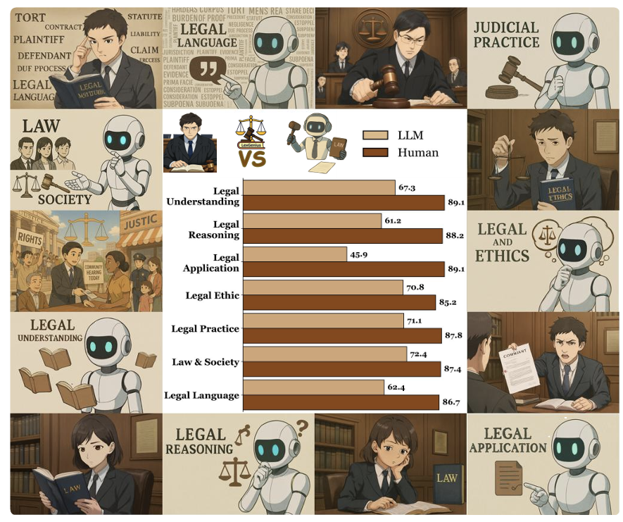
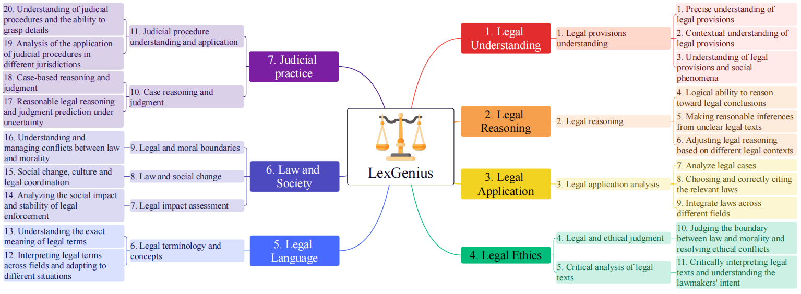

# LexGenius: An Expert-Level Benchmark for Large Language Models in Chinese Legal General Intelligence

### **LexGenius**: An Expert-Level Benchmark for Large Language Models in Chinese Legal General Intelligence

[📄 Paper](https://arxiv.org/abs/2511.01016) | [🚀 Quick Start](#quick-start-prompt-r1) | [💬 Contact](mailto:wenjinliu23@outlook.com)

---

## Overview

  

**LexGenius** addresses a fundamental challenge in applying large language models (LLMs) to the legal domain—the absence of a professional, systematic, and trustworthy evaluation framework for legal intelligence. **LexGenius** is an **expert-level benchmarking suite** designed for Chinese legal scenarios, assessing LLMs across diverse legal tasks and capability dimensions to measure their understanding, reasoning, and normative application skills. Through rigorous dataset construction, realistic legal problem design, and human–LLM collaborative validation, **LexGenius** significantly enhances the objectivity, discriminability, and reliability of legal intelligence evaluation, offering actionable insights for model development, optimization, and deployment—without requiring users to build separate assessment systems.

  

By integrating the **three-level structure of seven legal dimensions, eleven tasks, and twenty abilities**, **LexGenius** provides a **structured legal intelligence evaluation framework** that supports systematic capability assessment and cross-model comparative analysis across diverse large-scale LLMs.

## Experimental Results
**Comparison of the 12 SOTA LLMs with human experts on 7 core dimensions of legal intelligence:**

  

**Performance of 12 LLMs and human experts on 11 legal tasks, showing a significant gap between LLMs and humans:**

  

**Average ranking and average score ranking of the 12 SOTA LLMs in the 20 legal intelligence abilities.:**

  

